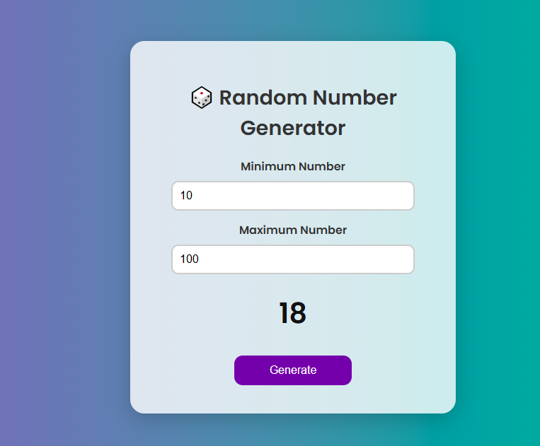

# 🎲 Random Number Generator

A clean, interactive web app built with **HTML**, **CSS**, and **JavaScript** that allows users to generate a random number between a user-defined minimum and maximum. Great for games, simple tasks, or just having fun!

---

## 📸 Demo

  

---

## 🚀 Features

- 🔢 User-defined min and max inputs
- ⚙️ Random number generation using `Math.random()`
- 💡 Input validation for safe and error-free generation
- 🎨 Modern and responsive UI
- 💻 Works seamlessly on desktop and mobile

---

## 🛠 Tech Stack

- **HTML5** – Structure
- **CSS3** – Styling & layout
- **JavaScript (Vanilla)** – Core logic

---

## 📂 Project Structure

📁 random-number-generator/ 
├── index.html         # Main HTML structure 
├── style.css          # Styles for layout and appearance 
├── script.js          # JavaScript logic for number generation 
└── README.md          # Project description and instructions 
